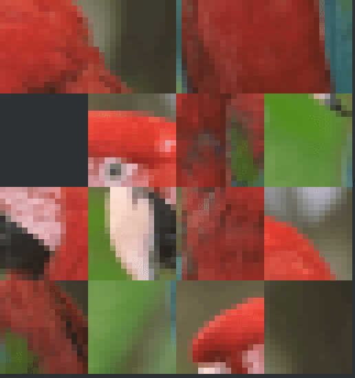

# fifteen

[](https://github.com/mosmeh/fifteen/actions)

The 15-puzzle in terminal



It uses half blocks (▀ and ▄) to draw pixels in terminal.

## Installation

Clone this repository and run:

```sh
cargo install --path .
```

## How to play

Play with the default image:

```sh
fifteen
```

You can move tiles with arrow keys, WASD, and HJKL.

Play with a custom image:

```sh
fifteen /path/to/image
```

Play on 3 x 3 board (i.e. 8-puzzle):

```sh
fifteen -n 3
```

## Colors

It supports terminals with and without 24-bit true colors.

Make sure the variable `$COLORTERM` is set to `truecolor` or `24bit` to enable true colors.

Refer to [this gist](https://gist.github.com/XVilka/8346728) to see which terminals support true colors.

## Command-line options

```
FLAGS:
    -c, --crop       Crops an image instead of stretching
    -h, --help       Prints help information
    -V, --version    Prints version information

OPTIONS:
    -n <n>        Play on n x n board [default: 4]

ARGS:
    <file>    Image file
```
